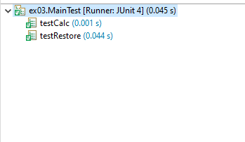

# Завдання 2

### Індивідуальне завдання: Визначити мобільного оператора за заданим номером абонента.
#### GetMobileOperator.java
````java
package ex01;

public class GetMobileOperator {

	 private Item2d result;

	    public GetMobileOperator() {
	        result = new Item2d();
	    }

	    public Item2d GetMobileOperatorByPhoneNumber(String phoneNumber) {
	    	String mobileOperator = "";
	    	if (phoneNumber.startsWith("+38091")) {
	    		mobileOperator = "3Mob";
	        }
	    	else if (phoneNumber.startsWith("+38092") ) {
	    		mobileOperator = "PEOPLEnet";
	    	}
	    	else if (phoneNumber.startsWith("+38094") ) {
	    		mobileOperator = "Інтертелеком";
	    	}
	    	else if (phoneNumber.startsWith("+38050") 
	                || phoneNumber.startsWith("+38066") 
	                || phoneNumber.startsWith("+38095") 
	                || phoneNumber.startsWith("+38099")) {
	    		mobileOperator = "Vodafone";
	        } else if (phoneNumber.startsWith("+38063") 
	                || phoneNumber.startsWith("+38073") 
	                || phoneNumber.startsWith("+38093")) {
	        	mobileOperator = "LifeCell";
	        } else if (phoneNumber.startsWith("+38067") 
	        		|| phoneNumber.startsWith("+38068") 
	                || phoneNumber.startsWith("+38096") 
	                || phoneNumber.startsWith("+38097") 
	                || phoneNumber.startsWith("+38098")) {
	        	mobileOperator = "KyivStar";
	        } else if (phoneNumber.startsWith("+38091") 
	                || phoneNumber.startsWith("+38092") 
	                || phoneNumber.startsWith("+38032")) {
	        	mobileOperator = "Ukrtelecom (3mob)";
	        } else {
	        	mobileOperator = "Unknown operator";
	        }
	    	result.setVariables(phoneNumber, mobileOperator);
	    	return result;
	    
	    }
}
````

### Розробив клас, що серіалізується для зберігання параметрів і результатів обчислень:
#### Item2d.java
````java
package ex01;
import java.io.Serializable;
/** Хранит исходные данные и результат вычислений.*/
public class Item2d implements Serializable {

  // transient
  private String phoneNumber;

  private String mobileOperator;

  private static final long serialVersionUID = 1 L;

  public Item2d() {
    phoneNumber = "undefined";
    mobileOperator = "undefined";
  }

  public Item2d(String phoneNumber) {
    this.phoneNumber = phoneNumber;
  }

  public Item2d setVariables(String phoneNumber, String mobileOperator) {
    this.phoneNumber = phoneNumber;
    this.mobileOperator = mobileOperator;
    return this;

  }

  public String setPhoneNumber(String phoneNumber) {
    return this.phoneNumber = phoneNumber;
  }

  public String getPhoneNumber() {
    return this.phoneNumber;
  }

  public String setMobileOperator(String mobileOperator) {
    return this.mobileOperator = mobileOperator;
  }
  public String getMobileOperator() {
    return this.mobileOperator;
  }
  @Override
  public String toString() {
    return "PhoneNumber: " + phoneNumber + ", mobile operator: " + mobileOperator;
  }

  @Override
  public boolean equals(Object obj) {
    if (this == obj)
      return true;
    if (obj == null)
      return false;
    if (getClass() != obj.getClass())
      return false;

    Item2d other = (Item2d) obj;
    if (phoneNumber == null) {
      if (other.phoneNumber != null)
        return false;
    } else if (!phoneNumber.equals(other.phoneNumber))
      return false;

    if (mobileOperator == null) {
      if (other.mobileOperator != null)
        return false;
    } else if (!mobileOperator.equals(other.mobileOperator))
      return false;
    return true;
  }
}
````

### Використовуючи агрегування, розробив клас для знаходження рішення задачі:
#### Calc.java
````java
package ex01;
import java.io.IOException;
import java.io.FileInputStream;
import java.io.FileOutputStream;
import java.io.ObjectInputStream;
import java.io.ObjectOutputStream;
import java.util.Random;
/** Содержит реализацию методов для вычисления и отображения результатов.
 */
public class Calc {

  private static final String FNAME = "Item2d.bin";

  private Item2d result;

  private GetMobileOperator getMobileOperator;
  public Calc() {
    result = new Item2d();
    getMobileOperator = new GetMobileOperator();
  }

  public void setResult(Item2d result) {
    this.result = result;
  }

  public Item2d getResult() {
    return result;
  }

  public String init(String phoneNumber) {
    result = getMobileOperator.GetMobileOperatorByPhoneNumber(phoneNumber);
    return result.getMobileOperator();
  }

  public void show() {
    System.out.println(result);
  }

  public String GenerateRandomPhoneNumber() {
    Random random = new Random();

    int prefix;
    switch (random.nextInt(15)) {
    case 0:
      prefix = 50;
      break;
    case 1:
      prefix = 66;
      break;
    case 2:
      prefix = 95;
      break;
    case 3:
      prefix = 99;
      break;
    case 4:
      prefix = 67;
      break;
    case 5:
      prefix = 68;
      break;
    case 6:
      prefix = 96;
      break;
    case 7:
      prefix = 97;
      break;
    case 8:
      prefix = 98;
      break;
    case 9:
      prefix = 63;
      break;
    case 10:
      prefix = 73;
      break;
    case 11:
      prefix = 93;
      break;
    case 12:
      prefix = 91;
      break;
    case 13:
      prefix = 92;
      break;
    default:
      prefix = 94;
      break;
    }

    String phoneNumber = "+380" + prefix + String.format("%07d", random.nextInt(10000000));

    return phoneNumber;

  }
  public void save() throws IOException {
    ObjectOutputStream os = new ObjectOutputStream(new FileOutputStream(FNAME));
    os.writeObject(result);
    os.flush();
    os.close();
  }

  public void restore() throws Exception {
    ObjectInputStream is = new ObjectInputStream(new FileInputStream(FNAME));
    result = (Item2d) is.readObject();
    is.close();
  }
}
````
### Розробив клас для демонстрації в діалоговому режимі збереження та відновлення стану об'єкта, використовуючи серіалізацію. Показав особливості використання transient полів:
#### Main.java
````java
package ex01;
import java.io.IOException;
import java.io.BufferedReader;
import java.io.InputStreamReader;
/** Вычисление и отображение результатов.
  Содержит реализацию статического метода main()*/
public class Main {

  private Calc calc = new Calc();

  private void menu() {
    String s = null;
    BufferedReader in = new BufferedReader(new InputStreamReader(System.in));
    do {
      do {
        System.out.println("Enter command...");
        System.out.print("'q'uit, 'v'iew, 'g'enerate, 's'ave, 'r'estore: ");
        try {
          s = in.readLine();
        } catch (IOException e) {
          System.out.println("Error: " + e);
          System.exit(0);
        }
      } while (s.length() != 1);
      switch (s.charAt(0)) {
      case 'q':
        System.out.println("Exit.");
        break;
      case 'v':
        System.out.println("View current.");
        calc.show();
        break;
      case 'g':
        System.out.println("Random generation.");
        calc.init(calc.GenerateRandomPhoneNumber());
        calc.show();
        break;
      case 's':
        System.out.println("Save current.");
        try {
          calc.save();
        } catch (IOException e) {
          System.out.println("Serialization error: " + e);
        }
        calc.show();
        break;
      case 'r':
        System.out.println("Restore last saved.");
        try {
          calc.restore();
        } catch (Exception e) {

          System.out.println("Serialization error: " + e);
        }
        calc.show();
        break;
      default:
        System.out.print("Wrong command. ");
      }
    } while (s.charAt(0) != 'q');
  }

  public static void main(String[] args) {
    Main main = new Main();
    main.menu();
  }
}
````
### Розробив клас для тестування коректності результатів обчислень та серіалізації/десеріалізації:
#### MainTest.java
````java
package ex01;
import org.junit.Test;
import static org.junit.Assert.assertEquals;
import junit.framework.Assert;
import java.io.IOException;
import ex01.Calc;
/** Выполняет тестирование разработанных классов.
 */

public class MainTest {

  @Test
  public void testCalc() {
    Calc calc = new Calc();
    calc.init("+380925277622");
    assertEquals(calc.getResult().getMobileOperator(), "PEOPLEnet");
    calc.show();
    calc.init("+380505336907");
    assertEquals(calc.getResult().getMobileOperator(), "Vodafone");
    calc.show();
    calc.init("+380984007208");
    assertEquals(calc.getResult().getMobileOperator(), "KyivStar");
    calc.show();
    calc.init("+380660111563");
    assertEquals(calc.getResult().getMobileOperator(), "Vodafone");
    calc.show();
    calc.init("+380941989316");
    assertEquals(calc.getResult().getMobileOperator(), "Інтертелеком");
    calc.show();
  }

  @Test
  public void testSerialization() {
    System.out.println("Serialization test:");
    Calc calc = new Calc();
    calc.init(calc.GenerateRandomPhoneNumber());
    System.out.println(calc.getResult());
    try {
      calc.save();
      System.out.println("Calculation result saved.");
      calc.setResult(new Item2d());
      calc.restore();
      System.out.println("Calculation result restored.");
      System.out.println("Result:");
      calc.show();
    } catch (Exception e) {
      System.out.println("serialization error: " + e);
    }
  }
}
````
### Результати роботи програми
#### Пройдені тести:


#### Обчислення:

#### Серіалізаці/десеріалізація:


# Завдання 3
### Product (шаблон проектування Factory Method), інтерфейс "фабрикованих" об'єктів, оголошує методи відображення об'єктів:
#### View.java
````java
package ex03;
import java.io.IOException;

public interface View {
/** Отображает заголовок */
public void viewHeader();
/** Отображает основную часть */
public void viewBody();
/** Отображает окончание */
public void viewFooter();
/** Отображает объект целиком */
public void viewShow();

public void FillCollectionWithRandom();
/** Выполняет инициализацию */
public void viewInit();
/** Сохраняет данные для последующего восстановления */
public void viewSave() throws IOException;
/** Восстанавливает ранее сохранённые данные */
public void viewRestore() throws Exception;
}
````

### Шаблон проектування Factory Method,оголошує метод, "фабрикуючий" об'єкти:
#### Viewable.java
````java
package ex03;

public interface Viewable {
/** Создаёт объект, реализующий {@linkplain View} */
public View getView();
}
#### ViewableResult.java
````java
package ex03;

public class ViewableResult implements Viewable {
/** Создаёт отображаемый объект {@linkplain ViewResult} */
@Override
public View getView() {
return new ViewResult();
}
}
````
### Обчислення та відображення результатів, містить реалізацію статичного методу main():
#### Main.java
````java
package ex03;
import java.io.IOException;
import java.io.BufferedReader;
import java.io.InputStreamReader;
/** Вычисление и отображение результатов.
  Содержит реализацию статического метода main()*/
public class Main {

	
    private View view;

    public Main(View view) {
        this.view = view;
    }


  private void menu() {
    String s = null;
    BufferedReader in = new BufferedReader(new InputStreamReader(System.in));
    do {
      do {
        System.out.println("Enter command...");
        System.out.print("'q'uit, 'v'iew, 'g'enerate, 's'ave, 'r'estore: ");
        try {
          s = in.readLine();
        } catch (IOException e) {
          System.out.println("Error: " + e);
          System.exit(0);
        }
      } while (s.length() != 1);
      switch (s.charAt(0)) {
      case 'q':
        System.out.println("Exit.");
        break;
      case 'v':
        System.out.println("View current.");
        view.viewShow();
        break;
      case 'g':
        System.out.println("Random generation.");
        view.FillCollectionWithRandom();
        view.viewInit();
        view.viewShow();
        break;
      case 's':
        System.out.println("Save current.");
        try {
          view.viewSave();
        } catch (IOException e) {
          System.out.println("Serialization error: " + e);
        }
        view.viewShow();
        break;
      case 'r':
        System.out.println("Restore last saved.");
        try {
          view.viewRestore();
        } catch (Exception e) {

          System.out.println("Serialization error: " + e);
        }
        view.viewShow();
        break;
      default:
        System.out.print("Wrong command. ");
      }
    } while (s.charAt(0) != 'q');
  }

  public static void main(String[] args) {
    Main main = new Main(new ViewableResult().getView());
    main.menu();
  }
}
````
### ConcreteProduct (Шаблон проектування Factory Method), обчислення функції, збереження та відображення результатів:
#### ViewResult.java
````java
package ex03;

import java.io.FileInputStream;
import java.io.FileOutputStream;
import java.io.IOException;
import java.io.ObjectInputStream;
import java.io.ObjectOutputStream;
import java.util.ArrayList;
import java.util.Random;


public class ViewResult implements View {

    
    private static final String FNAME = "Item2d.bin";

  
    private static final int DEFAULT_NUM = 10;

    
    private ArrayList<Item2d> items2d = new ArrayList<Item2d>();

    public ViewResult() {
        this(DEFAULT_NUM);
    }

    public ViewResult(int n) {
        for (int ctr = 0; ctr < n; ctr++) {
            items2d.add(new Item2d());
        }
    }

    public ArrayList<Item2d> getItems() {
        return items2d;
    }

 
    public String GenerateRandomPhoneNumber() {
        Random random = new Random();

        int prefix;
        switch (random.nextInt(15)) {
        case 0:
          prefix = 50;
          break;
        case 1:
          prefix = 66;
          break;
        case 2:
          prefix = 95;
          break;
        case 3:
          prefix = 99;
          break;
        case 4:
          prefix = 67;
          break;
        case 5:
          prefix = 68;
          break;
        case 6:
          prefix = 96;
          break;
        case 7:
          prefix = 97;
          break;
        case 8:
          prefix = 98;
          break;
        case 9:
          prefix = 63;
          break;
        case 10:
          prefix = 73;
          break;
        case 11:
          prefix = 93;
          break;
        case 12:
          prefix = 91;
          break;
        case 13:
          prefix = 92;
          break;
        default:
          prefix = 94;
          break;
        }

        String phoneNumber = "+380" + prefix + String.format("%07d", random.nextInt(10000000));

        return phoneNumber;

      }
    
    public String GetMobileOperatorByPhoneNumber(String phoneNumber) {
    	String mobileOperator = "";
    	if (phoneNumber.startsWith("+38091")) {
    		mobileOperator = "3Mob";
        }
    	else if (phoneNumber.startsWith("+38092") ) {
    		mobileOperator = "PEOPLEnet";
    	}
    	else if (phoneNumber.startsWith("+38094") ) {
    		mobileOperator = "Інтертелеком";
    	}
    	else if (phoneNumber.startsWith("+38050") 
                || phoneNumber.startsWith("+38066") 
                || phoneNumber.startsWith("+38095") 
                || phoneNumber.startsWith("+38099")) {
    		mobileOperator = "Vodafone";
        } else if (phoneNumber.startsWith("+38063") 
                || phoneNumber.startsWith("+38073") 
                || phoneNumber.startsWith("+38093")) {
        	mobileOperator = "LifeCell";
        } else if (phoneNumber.startsWith("+38067") 
        		|| phoneNumber.startsWith("+38068") 
                || phoneNumber.startsWith("+38096") 
                || phoneNumber.startsWith("+38097") 
                || phoneNumber.startsWith("+38098")) {
        	mobileOperator = "KyivStar";
        } else if (phoneNumber.startsWith("+38091") 
                || phoneNumber.startsWith("+38092") 
                || phoneNumber.startsWith("+38032")) {
        	mobileOperator = "Ukrtelecom (3mob)";
        } else {
        	mobileOperator = "Unknown operator";
        }
    	return mobileOperator;
    
    }
    public void FillCollectionWithRandom() {
    	for (Item2d item : items2d) {
    		item.setPhoneNumber(GenerateRandomPhoneNumber());
    	}
    }
 

    public void init() {
        for (Item2d item : items2d) {
            item.setResult(GetMobileOperatorByPhoneNumber(item.getPhoneNumber()));
        }
    }

    
    @Override
    public void viewInit() {
        init();
    }

   
    @Override
    public void viewSave() throws IOException {
        ObjectOutputStream os = new ObjectOutputStream(new FileOutputStream(FNAME));
        os.writeObject(items2d);
        os.flush();
        os.close();
    }

   
    @SuppressWarnings("unchecked")
    @Override
    public void viewRestore() throws Exception {
        ObjectInputStream is = new ObjectInputStream(new FileInputStream(FNAME));
        items2d = (ArrayList<Item2d>) is.readObject();
        is.close();
    }

   
    @Override
    public void viewHeader() {
        System.out.println("Calculating...");
    }

  
    @Override
    public void viewBody() {
        for (Item2d item : items2d) {
            System.out.println("\nPhone number: " + item.getPhoneNumber() + "	mobile operator: " + item.getResult());
  
        }
    }

    
    @Override
    public void viewFooter() {
        System.out.println("\nEnd.\n");
    }

  
    @Override
    public void viewShow() {
        viewHeader();
        viewBody();
        viewFooter();
    }
}
````
### Тестування розроблених класів:
#### MainTest.java
````java
package ex03;
import org.junit.Test;


import ex03.Item2d;
import ex03.View;

import static org.junit.Assert.assertEquals;
import static org.junit.Assert.assertTrue;
import junit.framework.Assert;
import java.io.IOException;
/** Выполняет тестирование разработанных классов.
 */

public class MainTest {

  @Test
  public void testCalc() {
	ViewResult view = new ViewResult(3);
    Item2d item = new Item2d();
    int ctr = 0;
    item.setVariables("+380924578761", "PEOPLEnet");
    view.getItems().get(ctr).setPhoneNumber("+380924578761");
    view.viewInit();
  
    assertTrue("expected:<" + item + "> but was:<" + view.getItems().get(ctr) + ">", view.getItems().get(ctr).equals(item));
    ctr++;
    
    item.setVariables("+380505336907", "Vodafone");
    view.getItems().get(ctr).setPhoneNumber("+380505336907");
    view.viewInit();
   
    assertTrue("expected:<" + item + "> but was:<" + view.getItems().get(ctr) + ">", view.getItems().get(ctr).equals(item));
    ctr++;
    item.setVariables("+380984007208", "KyivStar");
    view.getItems().get(ctr).setPhoneNumber("+380984007208");
    view.viewInit();
   
    assertTrue("expected:<" + item + "> but was:<" + view.getItems().get(ctr) + ">", view.getItems().get(ctr).equals(item));

  }

  

  @Test
  public void testRestore() {
	  ViewResult view1 = new ViewResult(1000);
	  ViewResult view2 = new ViewResult();
	  
	  view1.init();
	  
	  try {
	  view1.viewSave();
	  } catch (IOException e) {
	  Assert.fail(e.getMessage());
	  }
	 
	  try {
	  view2.viewRestore();
	  } catch (Exception e) {
	  Assert.fail(e.getMessage());
	  }
	  
	  assertEquals(view1.getItems().size(), view2.getItems().size());
	  
	  assertTrue("containsAll()", view1.getItems().containsAll(view2.getItems()));
  }
}
````
### Виконані тести:


# Завдання 4

>-	за основу використовувати вихідний текст проекту попередньої лабораторної роботи Використовуючи шаблон проектування Factory Method (Virtual Constructor), розширити ієрархію похідними класами, реалізують методи для подання результатів у вигляді текстової таблиці. Параметри відображення таблиці мають визначатися користувачем;
>-	продемонструвати заміщення (перевизначення, overriding), поєднання (перевантаження, overloading), динамічне призначення методів (Пізнє зв'язування, поліморфізм, dynamic method dispatch);
>-	забезпечити діалоговий інтерфейс із користувачем;
>-	розробити клас для тестування основної функціональност;
>-	використати коментарі для автоматичної генерації документації засобами javadoc;


#### Main.java
````java
package ex04;
import ex03.View;
/** Вычисление и отображение результатов<br>
* Содержит реализацию статического метода main()
* @author xone
* @version 3.0
* @see Main#main
*/
public class Main extends ex03.Main {
/** Инициализирует поле {@linkplain ex02.Main#view view} */
public Main(View view) {
super(view);
}
/** Выполняется при запуске программы;
* вызывает метод {@linkplain ex02.Main#menu menu()}
* @param args - параметры запуска программы
*/
public static void main(String[] args) {
Main main = new Main(new ViewableTable().getView());
main.menu();
}
}
````

# Завдання 5

>-	реалізувати можливість скасування (undo) операцій (команд);
>-	продемонструвати поняття "макрокоманда";
>- при розробці програми використовувати шаблон Singletone;
>-	забезпечити діалоговий інтерфейс із користувачем;
>-	розробити клас для тестування функціональності програми;


#### Main.java
````java
package ex05;
/** Вычисление и отображение
* результатов; cодержит реализацию
* статического метода main()
* @author xone
* @version 4.0
* @see Main#main
*/
public class Main {
/** Выполняется при запуске программы;
* вызывает метод {@linkplain Application#run()}
* @param args параметры запуска программы
*/
public static void main(String[] args) {
Application app = Application.getInstance();
app.run();
}
}
````

# Завдання 6

>-	продемонструвати можливість паралельної обробки елементів колекції (пошук мінімуму, максимуму, обчислення середнього значення, відбір за критерієм, статистична обробка тощо);
>-	управління чергою завдань (команд) реалізувати за допомогою шаблону Worker Thread;


#### Main.java
````java
package ex06;

import ex03.View;
import ex03.ViewableResult;
import ex05.ChangeConsoleCommand;
import ex05.GenerateConsoleCommand;
import ex05.Menu;
import ex05.ViewConsoleCommand;
/** Вычисление и отображение
* результатов; содержит реализацию
* статического метода main()
* @author xone
* @version 5.0
* @see Main#main
*/
public class Main {
/** Объект, реализующий интерфейс {@linkplain View};
* обслуживает коллекцию объектов {@linkplain ex01.Item2d};

15

* инициализируется с помощью Factory Method
*/
private View view = new ViewableResult().getView();
/** Объект класса {@linkplain Menu};
* макрокоманда (шаблон Command)
*/
private Menu menu = new Menu();
/** Обработка команд пользователя */
public void run() {
menu.add(new ViewConsoleCommand(view));
menu.add(new GenerateConsoleCommand(view));
menu.add(new ChangeConsoleCommand(view));
menu.add(new ExecuteConsoleCommand(view));
menu.execute();
}
/** Выполняется при запуске программы
* @param args параметры запуска программы
*/
public static void main(String[] args) {
Main main = new Main();
main.run();
}
}
````

# Завдання 7

>- Розробити ієрархію класів відповідно до шаблону Observer (java) та продемонструвати можливість обслуговування розробленої раніше колекції (об'єкт, що спостерігається, Observable) різними (не менше двох) спостерігачами (Observers) – відстеження змін, упорядкування, висновок, відображення і т.д.
>- При реалізації ієрархії класів використати інструкції (Annotation). Відзначити особливості різних політик утримання анотацій (annotation retention policies). Продемонструвати підтримку класів концепції рефлексії (Reflection).
>- Використовуючи раніше створені класи, розробити додаток, що відображає результати обробки колекції об'єктів у графічному вигляді
>- Забезпечити діалоговий інтерфейс з користувачем та перемальовування графіка під час зміни значень елементів колекції.


## Результати роботи програми
