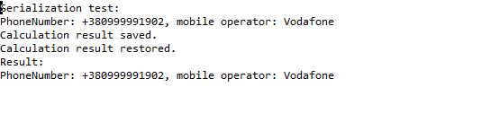

# Завдання 2

### Індивідуальне завдання: Визначити мобільного оператора за заданим номером абонента.
#### GetMobileOperator.java
````java
package ex01;

public class GetMobileOperator {

	 private Item2d result;

	    public GetMobileOperator() {
	        result = new Item2d();
	    }

	    public Item2d GetMobileOperatorByPhoneNumber(String phoneNumber) {
	    	String mobileOperator = "";
	    	if (phoneNumber.startsWith("+38091")) {
	    		mobileOperator = "3Mob";
	        }
	    	else if (phoneNumber.startsWith("+38092") ) {
	    		mobileOperator = "PEOPLEnet";
	    	}
	    	else if (phoneNumber.startsWith("+38094") ) {
	    		mobileOperator = "Інтертелеком";
	    	}
	    	else if (phoneNumber.startsWith("+38050") 
	                || phoneNumber.startsWith("+38066") 
	                || phoneNumber.startsWith("+38095") 
	                || phoneNumber.startsWith("+38099")) {
	    		mobileOperator = "Vodafone";
	        } else if (phoneNumber.startsWith("+38063") 
	                || phoneNumber.startsWith("+38073") 
	                || phoneNumber.startsWith("+38093")) {
	        	mobileOperator = "LifeCell";
	        } else if (phoneNumber.startsWith("+38067") 
	        		|| phoneNumber.startsWith("+38068") 
	                || phoneNumber.startsWith("+38096") 
	                || phoneNumber.startsWith("+38097") 
	                || phoneNumber.startsWith("+38098")) {
	        	mobileOperator = "KyivStar";
	        } else if (phoneNumber.startsWith("+38091") 
	                || phoneNumber.startsWith("+38092") 
	                || phoneNumber.startsWith("+38032")) {
	        	mobileOperator = "Ukrtelecom (3mob)";
	        } else {
	        	mobileOperator = "Unknown operator";
	        }
	    	result.setVariables(phoneNumber, mobileOperator);
	    	return result;
	    
	    }
}
````

### Розробив клас, що серіалізується для зберігання параметрів і результатів обчислень:
#### Item2d.java
````java
package ex01;
import java.io.Serializable;
/** Хранит исходные данные и результат вычислений.*/
public class Item2d implements Serializable {

  // transient
  private String phoneNumber;

  private String mobileOperator;

  private static final long serialVersionUID = 1 L;

  public Item2d() {
    phoneNumber = "undefined";
    mobileOperator = "undefined";
  }

  public Item2d(String phoneNumber) {
    this.phoneNumber = phoneNumber;
  }

  public Item2d setVariables(String phoneNumber, String mobileOperator) {
    this.phoneNumber = phoneNumber;
    this.mobileOperator = mobileOperator;
    return this;

  }

  public String setPhoneNumber(String phoneNumber) {
    return this.phoneNumber = phoneNumber;
  }

  public String getPhoneNumber() {
    return this.phoneNumber;
  }

  public String setMobileOperator(String mobileOperator) {
    return this.mobileOperator = mobileOperator;
  }
  public String getMobileOperator() {
    return this.mobileOperator;
  }
  @Override
  public String toString() {
    return "PhoneNumber: " + phoneNumber + ", mobile operator: " + mobileOperator;
  }

  @Override
  public boolean equals(Object obj) {
    if (this == obj)
      return true;
    if (obj == null)
      return false;
    if (getClass() != obj.getClass())
      return false;

    Item2d other = (Item2d) obj;
    if (phoneNumber == null) {
      if (other.phoneNumber != null)
        return false;
    } else if (!phoneNumber.equals(other.phoneNumber))
      return false;

    if (mobileOperator == null) {
      if (other.mobileOperator != null)
        return false;
    } else if (!mobileOperator.equals(other.mobileOperator))
      return false;
    return true;
  }
}
````

### Використовуючи агрегування, розробив клас для знаходження рішення задачі:
#### Calc.java
````java
package ex01;
import java.io.IOException;
import java.io.FileInputStream;
import java.io.FileOutputStream;
import java.io.ObjectInputStream;
import java.io.ObjectOutputStream;
import java.util.Random;
/** Содержит реализацию методов для вычисления и отображения результатов.
 */
public class Calc {

  private static final String FNAME = "Item2d.bin";

  private Item2d result;

  private GetMobileOperator getMobileOperator;
  public Calc() {
    result = new Item2d();
    getMobileOperator = new GetMobileOperator();
  }

  public void setResult(Item2d result) {
    this.result = result;
  }

  public Item2d getResult() {
    return result;
  }

  public String init(String phoneNumber) {
    result = getMobileOperator.GetMobileOperatorByPhoneNumber(phoneNumber);
    return result.getMobileOperator();
  }

  public void show() {
    System.out.println(result);
  }

  public String GenerateRandomPhoneNumber() {
    Random random = new Random();

    int prefix;
    switch (random.nextInt(15)) {
    case 0:
      prefix = 50;
      break;
    case 1:
      prefix = 66;
      break;
    case 2:
      prefix = 95;
      break;
    case 3:
      prefix = 99;
      break;
    case 4:
      prefix = 67;
      break;
    case 5:
      prefix = 68;
      break;
    case 6:
      prefix = 96;
      break;
    case 7:
      prefix = 97;
      break;
    case 8:
      prefix = 98;
      break;
    case 9:
      prefix = 63;
      break;
    case 10:
      prefix = 73;
      break;
    case 11:
      prefix = 93;
      break;
    case 12:
      prefix = 91;
      break;
    case 13:
      prefix = 92;
      break;
    default:
      prefix = 94;
      break;
    }

    String phoneNumber = "+380" + prefix + String.format("%07d", random.nextInt(10000000));

    return phoneNumber;

  }
  public void save() throws IOException {
    ObjectOutputStream os = new ObjectOutputStream(new FileOutputStream(FNAME));
    os.writeObject(result);
    os.flush();
    os.close();
  }

  public void restore() throws Exception {
    ObjectInputStream is = new ObjectInputStream(new FileInputStream(FNAME));
    result = (Item2d) is.readObject();
    is.close();
  }
}
````
### Розробив клас для демонстрації в діалоговому режимі збереження та відновлення стану об'єкта, використовуючи серіалізацію. Показав особливості використання transient полів:
#### Main.java
````java
package ex01;
import java.io.IOException;
import java.io.BufferedReader;
import java.io.InputStreamReader;
/** Вычисление и отображение результатов.
  Содержит реализацию статического метода main()*/
public class Main {

  private Calc calc = new Calc();

  private void menu() {
    String s = null;
    BufferedReader in = new BufferedReader(new InputStreamReader(System.in));
    do {
      do {
        System.out.println("Enter command...");
        System.out.print("'q'uit, 'v'iew, 'g'enerate, 's'ave, 'r'estore: ");
        try {
          s = in.readLine();
        } catch (IOException e) {
          System.out.println("Error: " + e);
          System.exit(0);
        }
      } while (s.length() != 1);
      switch (s.charAt(0)) {
      case 'q':
        System.out.println("Exit.");
        break;
      case 'v':
        System.out.println("View current.");
        calc.show();
        break;
      case 'g':
        System.out.println("Random generation.");
        calc.init(calc.GenerateRandomPhoneNumber());
        calc.show();
        break;
      case 's':
        System.out.println("Save current.");
        try {
          calc.save();
        } catch (IOException e) {
          System.out.println("Serialization error: " + e);
        }
        calc.show();
        break;
      case 'r':
        System.out.println("Restore last saved.");
        try {
          calc.restore();
        } catch (Exception e) {

          System.out.println("Serialization error: " + e);
        }
        calc.show();
        break;
      default:
        System.out.print("Wrong command. ");
      }
    } while (s.charAt(0) != 'q');
  }

  public static void main(String[] args) {
    Main main = new Main();
    main.menu();
  }
}
````
### Розробив клас для тестування коректності результатів обчислень та серіалізації/десеріалізації:
#### MainTest.java
````java
package ex01;
import org.junit.Test;
import static org.junit.Assert.assertEquals;
import junit.framework.Assert;
import java.io.IOException;
import ex01.Calc;
/** Выполняет тестирование разработанных классов.
 */

public class MainTest {

  @Test
  public void testCalc() {
    Calc calc = new Calc();
    calc.init("+380925277622");
    assertEquals(calc.getResult().getMobileOperator(), "PEOPLEnet");
    calc.show();
    calc.init("+380505336907");
    assertEquals(calc.getResult().getMobileOperator(), "Vodafone");
    calc.show();
    calc.init("+380984007208");
    assertEquals(calc.getResult().getMobileOperator(), "KyivStar");
    calc.show();
    calc.init("+380660111563");
    assertEquals(calc.getResult().getMobileOperator(), "Vodafone");
    calc.show();
    calc.init("+380941989316");
    assertEquals(calc.getResult().getMobileOperator(), "Інтертелеком");
    calc.show();
  }

  @Test
  public void testRestore() {
    System.out.println("Restore test:");
    Calc calc = new Calc();
    String phoneNumber, mobileOperator;
    phoneNumber = calc.GenerateRandomPhoneNumber();
    mobileOperator = calc.init(phoneNumber);
    calc.show();
    try {
      calc.save();
    } catch (IOException e) {
      Assert.fail(e.getMessage());
    }
    System.out.println("Saved succesfully.");
    System.out.println("\nNew generation: ");
    calc.init(calc.GenerateRandomPhoneNumber());
    calc.show();
    try {
      calc.restore();
    } catch (Exception e) {
      Assert.fail(e.getMessage());
    }
    System.out.println("\nRestored succesfully.");
    assertEquals(mobileOperator, calc.getResult().getMobileOperator());

    assertEquals(phoneNumber, calc.getResult().getPhoneNumber());
    calc.show();
  }

  @Test
  public void testSerialization() {
    System.out.println("Serialization test:");
    Calc calc = new Calc();
    calc.init(calc.GenerateRandomPhoneNumber());
    System.out.println(calc.getResult());
    try {
      calc.save();
      System.out.println("Calculation result saved.");
      calc.setResult(new Item2d());
      calc.restore();
      System.out.println("Calculation result restored.");
      System.out.println("Result:");
      calc.show();
    } catch (Exception e) {
      System.out.println("serialization error: " + e);
    }
  }
}
````
### Результати роботи програми
#### Пройдені тести:


#### Обчислення:

#### Серіалізаці/десеріалізація:



